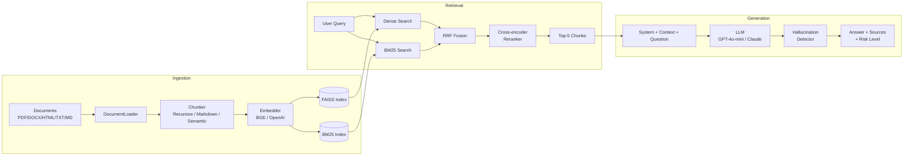

# Enterprise RAG Pipeline

A production-grade Retrieval-Augmented Generation system with hybrid search, hallucination detection, RAGAS evaluation, a REST API, and a Streamlit UI.

Employees ask natural-language questions about internal documents (PDF, DOCX, HTML, TXT, MD) and get grounded, cited answers.

## Architecture



## Quickstart

```bash
cp .env.example .env   # add OPENAI_API_KEY
make install            # pip install -r requirements.txt
make ingest             # index ./data/sample_docs -> ./data/vectorstore
make run-api            # uvicorn at :8000
make run-ui             # streamlit at :8501
```

Or Docker: `make docker-up` (single command, runs API + UI).

## API

| Method | Endpoint | Description |
|--------|----------|-------------|
| `GET` | `/health` | Health check |
| `GET` | `/stats` | Pipeline statistics |
| `POST` | `/ingest` | Upload documents (supports `chunk_strategy` param) |
| `POST` | `/query` | Ask a question, get answer + sources + hallucination check |
| `POST` | `/query/stream` | Same as `/query` but returns SSE tokens as they're generated |
| `POST` | `/evaluate` | Run RAGAS evaluation on a test set |
| `DELETE` | `/index` | Clear the vector store |

### /ingest

Upload one or more files. Supports optional chunking overrides:

```bash
curl -X POST http://localhost:8000/ingest \
  -F "files=@report.pdf" \
  -F "chunk_strategy=markdown" \
  -F "chunk_size=256"
```

### /query

```bash
curl -X POST http://localhost:8000/query \
  -H "Content-Type: application/json" \
  -d '{"question": "What is the parental leave policy?"}'
```

Returns answer with cited `[Source N]` references, retrieved chunks, and hallucination risk level (`LOW` / `MEDIUM` / `HIGH`).

### /query/stream

Same body as `/query`, returns Server-Sent Events:

```
data: {"type": "retrieval", "content": 5}
data: {"type": "token", "content": "Primary"}
data: {"type": "token", "content": " caregivers"}
data: {"type": "token", "content": " receive"}
...
data: {"type": "sources", "content": {"sources": [...], "has_answer": true, "latency_ms": 842.3}}
```

### /evaluate

```bash
curl -X POST http://localhost:8000/evaluate \
  -H "Content-Type: application/json" \
  -d '{"questions": ["What is the leave policy?", "How does the 401k work?"]}'
```

Scores each question on faithfulness, answer relevancy, context precision. Results saved to `data/eval_report.json`.

## Evaluation

| Metric | Target | What it measures |
|--------|--------|-----------------|
| Faithfulness | > 0.80 | Are all claims grounded in the retrieved context? |
| Answer Relevancy | > 0.75 | Does the answer address the question? |
| Context Precision | > 0.70 | Is retrieved context relevant (no noise)? |
| Context Recall | > 0.70 | Does context contain all needed info? (requires ground truth) |

Hallucination risk: **LOW** (>= 0.75), **MEDIUM** (0.50-0.75), **HIGH** (< 0.50).

## Project structure

```
src/
  ingestion/     document_loader.py, chunker.py, embedder.py
  retrieval/     vector_store.py (FAISS), hybrid_retriever.py (BM25 + RRF + reranker)
  generation/    rag_chain.py (RAGChain, OpenAILLM, AnthropicLLM)
  evaluation/    ragas_eval.py, hallucination_detector.py
  api/           main.py (FastAPI)
ui/              app.py (Streamlit)
scripts/         ingest.py (CLI ingestion)
tests/           test_pipeline.py, test_api.py
data/            sample_docs/, vectorstore/
```

## Configuration (`.env`)

| Variable | Default | Description |
|----------|---------|-------------|
| `OPENAI_API_KEY` | — | Required for GPT-4o-mini |
| `EMBEDDING_PROVIDER` | `huggingface` | `huggingface` or `openai` |
| `EMBEDDING_MODEL` | `BAAI/bge-base-en-v1.5` | Local embedding model |
| `LLM_MODEL` | `gpt-4o-mini` | Generation model |
| `CHUNK_SIZE` | `512` | Characters per chunk |
| `RETRIEVAL_TOP_K` | `20` | Candidates before reranking |
| `RERANK_TOP_K` | `5` | Final chunks sent to LLM |
| `USE_HYBRID` | `true` | Enable BM25 + dense hybrid |
| `USE_RERANKER` | `true` | Enable cross-encoder reranking |

## Tech stack

- **Embeddings**: BAAI/bge-base-en-v1.5 (sentence-transformers) or text-embedding-3-small
- **Vector store**: FAISS (IndexFlatIP)
- **Sparse retrieval**: BM25 (rank-bm25)
- **Reranker**: cross-encoder/ms-marco-MiniLM-L-6-v2
- **Fusion**: Reciprocal Rank Fusion (k=60)
- **LLM**: OpenAI GPT-4o-mini or Anthropic Claude
- **API**: FastAPI + Uvicorn
- **UI**: Streamlit + Plotly
- **Testing**: pytest, FastAPI TestClient

## Makefile

| Command | Action |
|---------|--------|
| `make install` | `pip install -r requirements.txt` |
| `make run-api` | `uvicorn src.api.main:app --reload --port 8000` |
| `make run-ui` | `streamlit run ui/app.py` |
| `make ingest` | `python scripts/ingest.py --dir ./data/sample_docs` |
| `make test` | `pytest tests/ -v --tb=short` |
| `make lint` | `ruff check src/ tests/` |
| `make format` | `ruff format src/ tests/` |
| `make docker-up` | `docker-compose up --build -d` |
